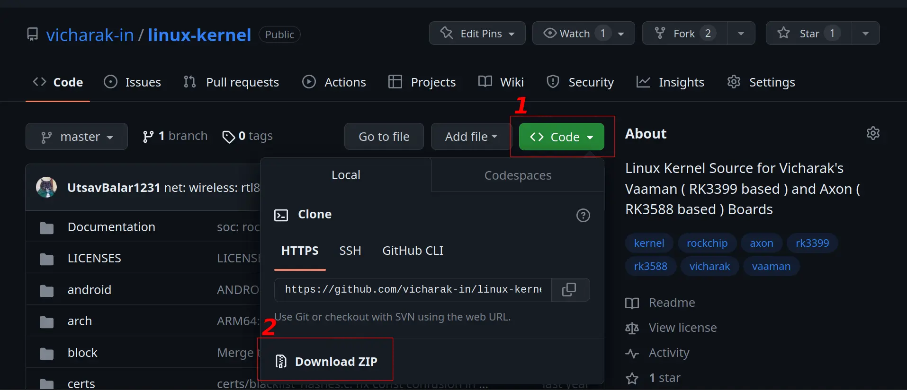

# Build Vicharak Kernel from source

Vicharak Provides multiple revision of Linux kernels for Vaaman board.
:::{admonition} Please Refer to
[Types of kernels available for Vaaman](../linux-usage-guide/custom-linux-kernel.md#types-of-kernels-available-for-vaaman)
:::

## Installing the system dependencies

```bash
sudo apt-get install build-essential python libssl-dev git-core \
gcc-arm-linux-gnueabihf u-boot-tools device-tree-compiler gcc-aarch64-linux-gnu mtools parted pv
```

:::{warning}
It is recommended to use **Ubuntu 20.04** and Higher or **Debian 11** and Higher environment for building.
:::

## Getting the kernel source

Download the kernel source from [Vicharak's GitHub](https://github.com/vicharak-in/linux-kernel)

### Using Git Clone

```bash
git clone https://github.com/vicharak-in/linux-kernel -b <branch>
```

### Download the kernel as zip



**Follow the steps in above image or else try downloading from terminal.**

```bash
wget https://github.com/vicharak-in/linux-kernel/archive/refs/heads/master.zip

unzip linuz-kernel-master.zip
```

## Compiling the Linux kernel

### Enter the kernel directory

```bash
cd <kernel_diretory>
```

### Compile Rockchip Linux config

```bash
make O=out ARCH=arm64 rockchip_linux_defconfig
```

### Copy vaaman specific configs to .config

```bash
cat arch/arm64/configs/rk3399_vaaman.config >> out/.config
```

:::{warning}
On Vaaman kernel version 4.4 you will not have `arch/arm64/configs/rk3399_vaaman.config`.

So, for that just ignore using `cat` to copy vaaman specific configs inside .config.
:::

### Finally compile the kernel

```bash
make O=out ARCH=arm64 CROSS_COMPILE=aarch64-linux-gnu -j$(nproc --all)
```

**Upon successfull compilation, confirm that you have following files.**

- out/arch/arm64/boot/dts/rockchip/rk3399-vaaman-linux.dtb
- out/arch/arm64/boot/Image

:::{warning}
On Vaaman kernel version 4.4 you will not have `out/arch/arm64/boot/dts/rockchip/rk3399-vaaman-linux.dtb`.
Instead you might find `rk3399-vaaman.dtb` which is perfectly fine to use.
:::

## Compiling kernel using Vicharak's kernel building script

:::{admonition} Refer to
[Vicharak kernel building script](../linux-usage-guide/custom-linux-kernel.md#vicharak-kernel-script)
to compile and test the kernel with ease.
:::

## Compiling kernel modules

make O=out ARCH=arm64 modules_install INSTALL_MOD_DIR=out/modules -j$(nproc --all)

**Confirm the modules files in `out/modules/lib` folder**

:::{tip}
Set the specific driver that you want to build as module to `CONFIG_<XXXX>=m` inside .config
:::

:::{seealso}
[How to compile u-boot from source](./build-u-boot.md)

[How to flash compiled kernel](../linux-usage-guide/custom-linux-kernel.md#how-to-flash-compiled-kernel)

[How to flash u-boot](#/)
:::
