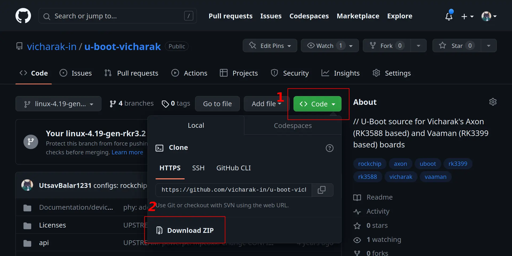

(build-u-boot)=

# U-Boot (Universal Boot Loader)

## What actually is u-boot?

U-Boot `Das U-Boot` is an open-source bootloader that can be used on various
platforms such as ARM, X86, MIPS, RISC-V and many more.
It is the Universal Boot Loader project and is actually used to boot the
Linux kernel in your Vicharak board.

:::{note}
More information can be found [here](https://en.wikipedia.org/wiki/Das_U-Boot).
:::

## Build Vicharak Vaaman U-Boot from source

:::{note}
Vicharak provides two different source for u-boot:

1. Vendor specific u-boot source.
2. Mainline u-boot source.

There are separate methods to compile and flash u-boot for these above sources.
:::

## Build Vendor specific u-boot

### Installing the system dependencies

```bash
sudo apt-get install build-essential python libssl-dev git-core \
    gcc-arm-linux-gnueabihf u-boot-tools device-tree-compiler \
    gcc-aarch64-linux-gnu mtools parted pv
```

### Getting the source

The source code for u-boot has been published to our
[GitHub organisation](https://github.com/vicharak-in).

#### Clone the repository using git

```bash
git clone https://github.com/vicharak/u-boot-vicharak
```

:::{tip}
Use `git clone --depth=1` to shallow clone the repository
:::

#### Download the source code from GitHub



**Follow the steps in above image or else try downloading from terminal.**

```bash
wget https://github.com/vicharak-in/u-boot-vicharak/archive/refs/heads/master.zip

unzip u-boot-vicharak-master.zip
```

### Compiling u-boot

#### Enter the u-boot directory

```bash
cd <u-boot-directory>
```

#### Compile using Rockchip u-boot script

```bash
./make.sh rk3399-vaaman
```

or

#### Compile using Vicharak u-boot script

```bash
git submodule update --init

./vicharak/build.sh vicharak/rk3399-vaaman.mk
./vicharak/build.sh -b
```

:::{tip}
Vicharak u-boot script is recommended for ease of use

The script is located in `vicharak/build.sh` and basic operations are as follows:

```text
    ─────────────────────────────────────────────────────────────────────
              Vicharak U-Boot Build Script - Usage Guide
    ─────────────────────────────────────────────────────────────────────
     Usage: ./vicharak/build.sh [OPTIONS]

     Available Options:
      lunch            | -l    : Prepare the environment for the chosen device
      info             | -i    : Display current u-boot setup details
      clean            | -c    : Remove u-boot build artifacts
      build            | -b    : Compile the u-boot for the chosen device
      ubootdeb         | -B    : Generate a debian package for the u-boot
      update_defconfig | -u    : Update the u-boot configuration with the latest changes
      help             | -h    : Display this usage guide
    ─────────────────────────────────────────────────────────────────────
```

:::

Output files will be inside current folder.
Make sure `idbloader`, `u-boot` and `trust` images are there.

:::{card} Confirm these files in the current directory

idblock.bin

idbloader.img

uboot.img

trust.img

rk3399_loader_v1.xx.xxx.bin
:::

:::{tip}
For Vendor u-boot source there is an option to build debian package as well.

Use the following command to build a debian package of the uboot.

```bash
./vicharak/build.sh -B
```

or

```bash
dpkg-buildpackage -b -rfakeroot -us -uc -a arm64
```

:::

### Compile Mainline u-boot

#### Installing the required system dependencies

```bash
sudo apt-get install build-essential python libssl-dev git-core \
    libgnutls28-dev gcc-arm-linux-gnueabihf u-boot-tools device-tree-compiler \
    gcc-aarch64-linux-gnu mtools parted pv
```

#### Getting the Mainline u-boot source

The source code for u-boot has been published to our
[GitHub organisation](https://github.com/vicharka-in/u-boot-vicharak/tree/vicharak-mainline).

#### Clone the repository using git

```bash
git clone https://github.com/vicharak-in/u-boot-vicharak -b vicharak-mainline
```

#### Compile ARM trusted firmware and u-boot

Clone the ARM trusted firmware source code from
[GitHub](https://github.com/arm-trusted-firmware/arm-trusted-firmware) and compile it.

```bash
cd arm-trusted-firmware
make realclean
make CROSS_COMPILE=aarch64-linux-gnu- PLAT=rk3399 bl31
```

Copy the compiled `bl31.elf` file to the u-boot directory.

```bash
cp build/rk3399/release/bl31/bl31.elf <u-boot-directory>
```

Enter the u-boot directory and compile the u-boot.

```bash
export BL31=bl31.elf
export ARCH=arm
export CROSS_COMPILE=aaarch64-linux-gnu-

make vaaman-rk3399_defconfig

make -j$(nproc --all)
```

Output files will be inside current directory. Make sure `idbloader.img`, `u-boot.itb` and `u-boot.img` images are there.

(flash-u-boot)=

## How to flash or upgrade u-boot

Once you have successfully compiled the u-boot. You are now ready to flash it on your vaaman board.

For Vicharak eMMC builds you can follow the `Linux Upgrade Tool` guide
:::{admonition} Refer to
[Flash u-boot to eMMC using upgrade_tool](../linux-usage-guide/rockchip-upgrade-tool-misc.rst)
:::

or

You can manually flash the images using UNIX `dd` utility.

**Secondary loader (SPL)**

For Vicharak eMMC builds you can follow the `Linux Upgrade Tool` guide
:::{admonition} Refer to
[Flash u-boot to eMMC using upgrade_tool](../linux-usage-guide/rockchip-upgrade-tool-misc.rst)
:::

or

```bash
sudo dd if=idblock.bin of=/dev/mmcblk1 seek=64; sync
```

:::{warning}
The block device `/dev/mmcblk1` may be different as per the board's storage configuration.

Confirm the block device using `parted /dev/mmcblk<X>`.
:::

**U-boot proper (uboot)**

```bash
sudo dd if=uboot.img of=/dev/mmcblk1p1; sync
```

**Trust image (trust)**

```bash
sudo dd if=trust.img of=/dev/mmcblk1p2; sync
```

Finally reboot the board.

```bash
sudo reboot
```

### Flashing Mainline u-boot

For Vicharak eMMC builds you need to merge partition 1 and 2 into one partition.

**Delete the trust partition**

```bash
sudo parted /dev/mmcblk1 rm 2
```

**Resize the u-boot partition**

```bash
sudo parted /dev/mmcblk1 resizepart 1 100%
```

**Flash the SPL and u-boot**

```bash
sudo dd if=idbloader.img of=/dev/mmcblk1 seek=64; sync

sudo dd if=u-boot.itb of=/dev/mmcblk1; sync
```

Finally reboot the board.

```bash
sudo reboot
```

:::{tip}
It is preferred not to use mainline u-boot for Vicharak images. As it follows rockchip's boot flow.
And things may break in future.

You can use mainline u-boot for your own custom images or community images such as Manjaro ARM, Armbian, etc.
:::

## Verify the u-boot version

After rebooting the board, you can verify the u-boot version using `version` command.

```bash
version
```

or

There will be a version string printed on the console during boot up.

```bash
U-Boot 2017.09-ge629234bf25-230427 #vicharak (Jul 11 2023 - 16:43:11 +0530)
```

### Enter the u-boot shell or command prompt

Vaaman's u-boot is configured for development purpose.
It will allow you 3 seconds to enter the u-boot shell before booting the kernel.

Press **CTRL+C** to enter the u-boot shell.

```{tip}
Set `CONFIG_BOOTDELAY` to `0` in `configs/rk3399-vaaman_defconfig` to disable the delay.

And recompile the u-boot.
```

:::{seealso}
[How to build linux kernel](#build-linux-kernel)

[How to use rockchip upgrade tool](#rockchip-develop-tool)
:::
